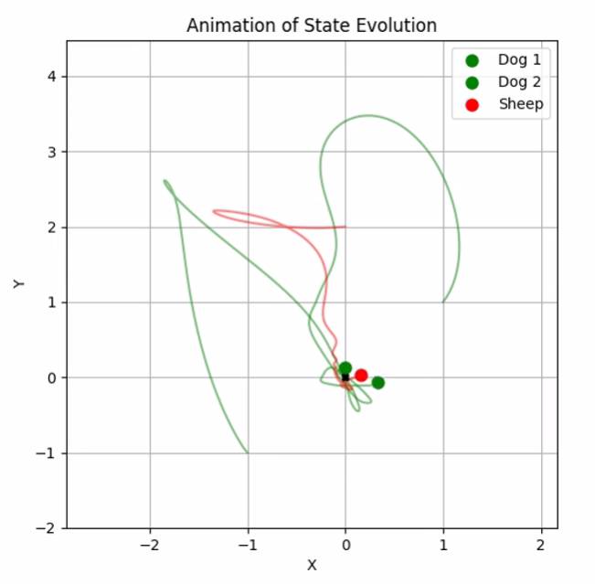
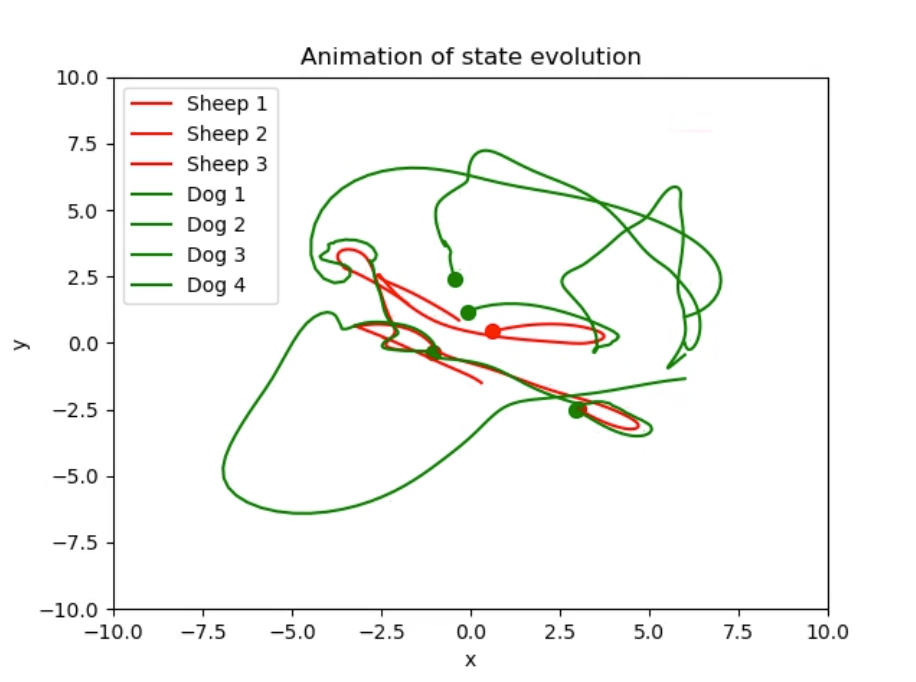
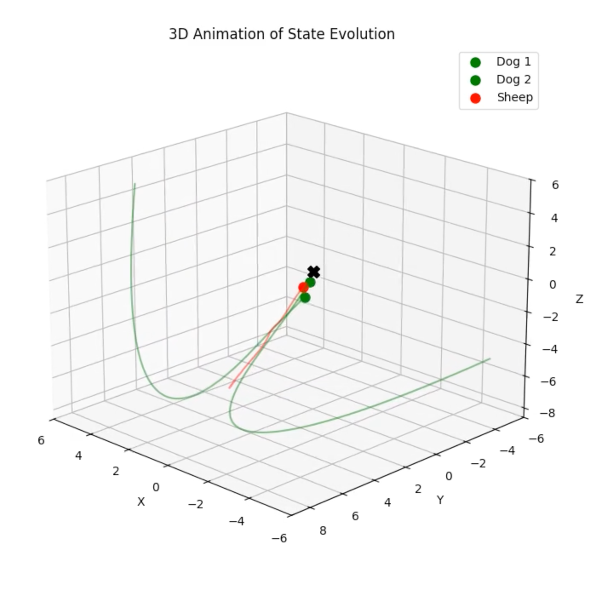

# Optimal Corralling of Sheep Using Optimal Control
## Overview
This project explores optimal control strategies for herding sheep using dogs, formulated as a multi-agent system. We apply methods like Pontryagin's Maximum Principle (PMP), boundary value problem (BVP) solvers, and iterative Linear Quadratic Regulator (iLQR) to compute control trajectories. The goal is to guide sheep to the origin while minimizing energy costs for the dogs.

## Key Features
Nonlinear Dynamics: Sheep flee from dogs with acceleration inversely proportional to distance.

Optimal Control: Solutions derived using PMP and solved numerically with solve_bvp.

Linearized Approximations: Infinite-time LQR and iLQR for scalable multi-agent control.

3D Simulations: Extensions to 3D herding scenarios.

## Installation
Clone the repository and install dependencies:

```bash
git clone https://github.com/brownthesr/Optimal_Paths
cd Optimal_Paths
pip install -r requirements.txt  # Install SciPy, NumPy, JAX, SymPy, Matplotlib
```
## File Descriptions
1. ```chasers_linear.py```

    Assumes linear dynamics and solves the Algebraic Riccati Equation (ARE) for infinite-time LQR control. Suitable for scenarios where linear approximations hold (e.g., agents far apart).

2. ```chasers_nonlinear.py```

    Uses iterative LQR (iLQR) with local linearization of dynamics around each state. Handles nonlinearities better than pure LQR but struggles when dogs/sheep are close.

3. ```pmp_solution.ipynb```

    Derives optimal control via PMP and solves the resulting BVP using ```solve_bvp``` for finite-time problems. Supports arbitrary numbers of dogs/sheep.

4. ```improved_bvp.ipynb```

    Enhances ```pmp_solution``` with better initial guesses, hyperparameter tuning, and regularization to improve BVP convergence.

## Usage
Example: 2 Dogs and 1 Sheep (Nonlinear iLQR)
```python
python chasers_nonlinear.py --dogs 2 --sheep 1 --alpha 30 --beta 2 --epsilon 0.1
```
### Hyperparameters:

alpha: Weight for sheep position cost (default: 30)

beta: Weight for dog position cost (default: 2)

epsilon: Regularization to avoid singularities (default: 0.1)

### Solving BVP with Improved Initialization
Run ```improved_bvp.ipynb``` to test strategies with custom initial positions:

```python
# Initialize dogs on a circle of radius 2
dog_positions = [[2*np.cos(theta), 2*np.sin(theta)] for theta in np.linspace(0, 2*np.pi, m)]
```
## Results
- BVP Method: Successfully herds 1 sheep with 2 dogs but struggles with scalability (Fig 1).

- iLQR: Scales to 4 dogs and 3 sheep but exhibits oscillatory paths near close interactions (Fig 2).

- 3D Simulations: Demonstrates extensibility to 3D environments (Fig 3).

### 2 Dogs, 1 Sheep (```solve_bvp```)

### 4 Dogs, 3 Sheep (```iLQR```)

### 3D Herding (```solve_bvp```)

## Challenges
- Nonlinear Dynamics: Strong repulsion forces near dogs cause instability.

- Convergence: solve_bvp requires careful initialization and hyperparameters.

- Scalability: LQR struggles with close interactions; BVP is limited by high dimensionality.

## Links
GitHub Repository: github.com/brownthesr/Optimal_Paths

Video Demonstrations: 
[](youtube.com/watch?v=AtLQeGqSamI)
References
For theoretical details, refer to the accompanying paper:
Brown, D. et al. "Corralling Sheep with Optimal Control." (2025).